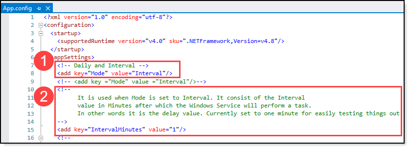
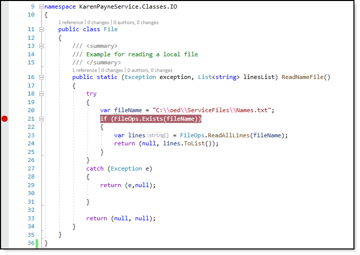
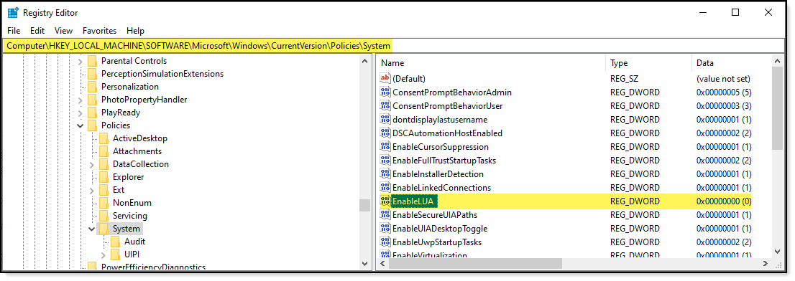

# About

This project provides a basic framework for creating a Windows Service in C#

## Order of operations

- KarenPayneService.Classes.OnStart is triggered which in turn when using the installer in this solution will stop on the line of code `Debugger.Launch();` which brings up a dialog. Select the current open instance of Visual Studio and press OK,
- The next line `RequestAdditionalTime(10000);` allows the Windows service manager time to process whatever it does outside of the service.
- `ScheduleService();` determines intervals for firing off, in this case `Dispatcher()` method
- `Dispatcher` method invokes IO.File.ReadNameFile() from KarenPayneService.Classes.IO.File class.
  - Here a file read from C:\oed\ServiceFiles named Names. So this means `C:\oed\ServiceFiles` folder must exists with a file named `Names.txt` otherwise nothing is done. If the file exists and read then the lines are returned. To walk through this code set a breakpoint as shown in figure 1.
-  Once the file operation completes (no need to alter these next two items)
   -  The following line of code `_serviceTimer.Dispose();` cleans up the service resources.
   -  Followed by beginning again using `ScheduleService();`

# Configure interval service runs

This is controlled in `app.config` file

1. Indicates the mode which operations are triggered, currently set to Interval which means go look a the `IntervalMinutes` setting.
2. `IntervalMinutes` setting is set to **1** which means wait one minute before firing off code in the `Dispatcher` method. For a production environment lets say you want the code to fire everyy one, set `IntervalMinutes` to **60**.  To run once a day at midnight set Mode to **DAILY** which has the schedule setup look at `ScheduledTime` setting that is current set to 2 minutes before midnight.

# Required

:heavy_check_mark: NuGet package System.ValueTuple {4.5.0}  KarenPayneService

To see NuGet packages open the Package Manager Console and run

:heavy_check_mark:  get-Package | ft -AutoSize

:heavy_check_mark: .NET Framework 4.8

# Permissions to run service locally

See the following Microsoft article [Visual Studio debugging windows services](https://social.technet.microsoft.com/wiki/contents/articles/53573.visual-studio-debugging-windows-services.aspx).

Which explains modifying the registry e.g

>Windows 8 and higher have tighten security so that when Debugger.Launch Jump  is hit there will be additional prompts to jump through which can become a nuance when there is a need for many debug sessions as this is the best method to figure out why code which looks good is not working as expected.

The solution for Windows 8 and higher is to first open Regedit to 

`HKLM\Software\Microsoft\Windows\CurrentVersion\Policies\System\EnableLUA` see **figure 2**

Microsoft [documentation](https://docs.microsoft.com/en-us/openspecs/windows_protocols/ms-gpsb/958053ae-5397-4f96-977f-b7700ee461ec) on `EnableLUA` 

# Install/uninstall Log file

If the service install or uninstall fails see the following log file.

:heavy_check_mark: Executable folder for installer `KarenPayneService.InstallLog` text file.

# Database

If a query is correct but fails to execute this may be an issue with permissions to the Oracle database as the service runs under SYSTEM account rather than a user account.

# Oracle code

Mockedup/sample code is in `InsertRecordExample` class using a mocked up class `CbrAddress`.

# Exception handling/logging

See Windows Event Log

# Screenshots

**Figure 1**

**Figure 2**

