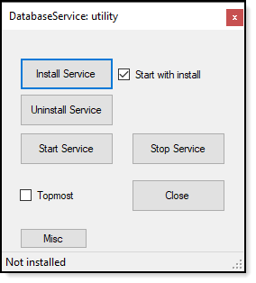
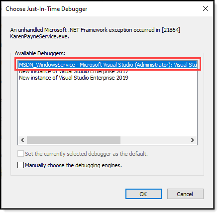
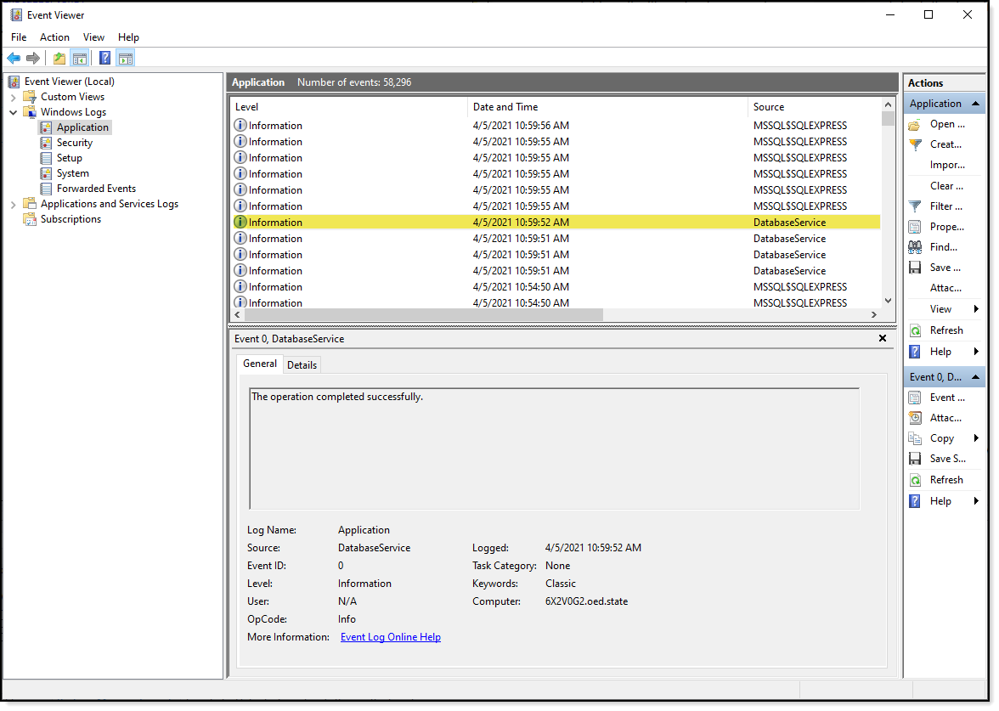

# Usage

:stop_sign: If this utility fails, the main reason is lack of permissions.




# Start service

- Build the projects (make sure this installer is not running as it will block the buid process).
- Run this installer
- At bottom of screen `not installed` means you can select `Install Service`, a successful install will read at bottom of screen `started` and the following dialog appears..

 

- This is followed by going to a breakpoint if you want to step into the code. Add breakpoints in your code to peek at your code flow.

# Uninstalling the service

- Click `Stop service`
- Click `Uninstall Service, a DOS window appears followed by a message box

Note that the other buttons are not needed presently.

# Logs

Both informational and runtime errors are writen to the Windows Event logs. Below shows a sample of a informational entry.



# Setting up for a service

Currently in app.config these setting are to run `KarenPayneService`.

```xml
<appSettings>
   <add key="ExecutableName" value="KarenPayneService.exe" />
   <add key="ServiceKnownName" value="DatabaseService" />
   <add key="ServiceProjectFolder" value="KarenPayneService" />
</appSettings>
```

:yellow_circle: To run another project, the project must be at the root level of this solution.

- Change `ExecutableName` to the name of the executable for the service
- Change `ServiceKnownName` to the service name
- Change `ServiceProjectFolder` to the project folder name.
