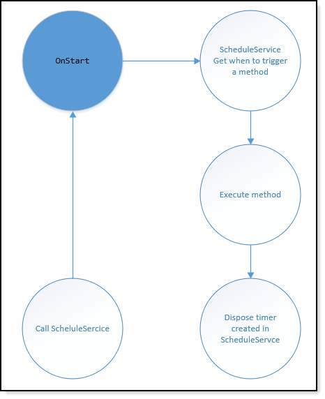

# About

This project is a raw/base starting point to write a windows service.

:bulb: Questions, ask Karen

:heavy_check_mark: Oracle ready

# Important steps

Follow the flow below from the service class

- `_serviceTimer` object drives when the operations intended to run get triggers
- `ScheduleService` is responsible for running business logic
- Use `EventLog.WriteEntry(`text for system event log`)` to log actions as informational
- Use `EventLog.WriteEntry(`text for system event log`,, EventLogEntryType.Error)` to log actions as an error

# Flow

# See also

[Tutorial: Create a Windows service app](https://docs.microsoft.com/en-us/dotnet/framework/windows-services/walkthrough-creating-a-windows-service-application-in-the-component-designer)