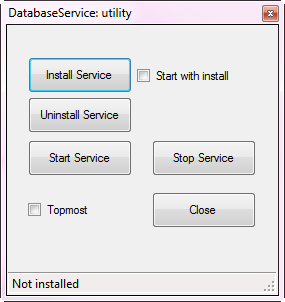

# TechNet article November 2018 
The article presents a Windows utility for interacting with a Windows service Jump during coding phase for start/stop and install/uninstalling, get status of your Windows service rather than opening Visual Studio command prompt, typing in a long command for install/uninstall.  

Also demonstrates using a simple Windows Service starting a debug session.

[Windows Service developer GUI for install while in development mode](https://social.technet.microsoft.com/wiki/contents/articles/52152.windows-service-developer-gui-for-install-while-in-development-mode.aspx)

